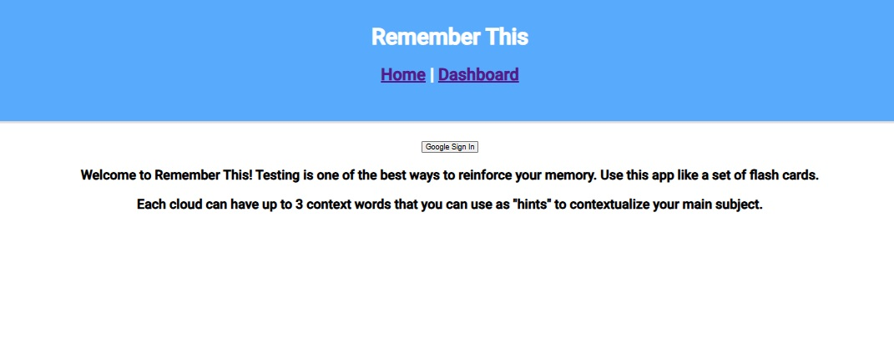
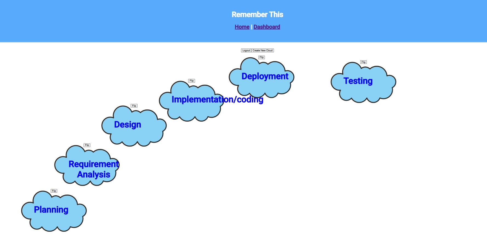

# Remember This

App can be accessed [here](https://remember-this-app.app/)

This is my first full-stack application, made as a study tool to help me remember terms and concepts during my CS degree.
The project is still very much in development and needs tidying up, but it is currently usable as a "flashcard" app. The concept was to incorporate spatial elements into a note-taking app, almost like a memory palace. I am planning to add more customizable elements and the ability to store images in the database.

## Technologies Used: 
Languages: Java, Typescript, HTML/CSS, SQL
Backend: Spring Boot 3. Spring Security 6 w/ OAuth2.0, JPA Persistence
Frontend: Angular 20 (Utillizing Signals, CdkDrag, Dialog, Fetch)
DB: MySQL80
Containerization, orchestration, CI/CD: Docker, Kubernetes, Gitlab 

## How It Was Made/Features
The front end is a standalone component-based SPA with dynamic elements. Its standalone architecture allows for relatively simple but effective user interactions like note population, deletion, editing, and dialog box interactions/form control. 
The main feature of note is Signals, which allows for active listening across all components. Signals allows for seamless database integration, allowing GET, POST, and DELETE requests to alter and respond to the database. The app also persists user data, populating their notes based on their OIDCUserID, ensuring isolated user sessions. The app also keeps track of absolute page location, which allows spatial configurations to persist even after logging out. 

The backend follows a typical MVC architecture with RESTful functionality to control HTTP requests. JPA is used to interact with the database, allowing all database queries to be managed by the Spring framework.

OAuth2.0 via Spring Security allows users to securely access their data. The flow is an Authorization Code Flow, and the user sends an XSRF token as well as a JSESSIONID cookie through the browser for fetch requests.

# Kubernetes

This app is deployed in a kubernetes cluster on the Digital Ocean cloud. It uses a helm chart for easy deployment, and there is GitLab CI/CD integration for rolling out new features. The cluster itself additionally uses an nginx ingress load balancer to route all external traffic and API calls to the correct service, as well as a cloudflare tunnel to direct traffic from remember-this-app.app to the cluster on the cloud. 

